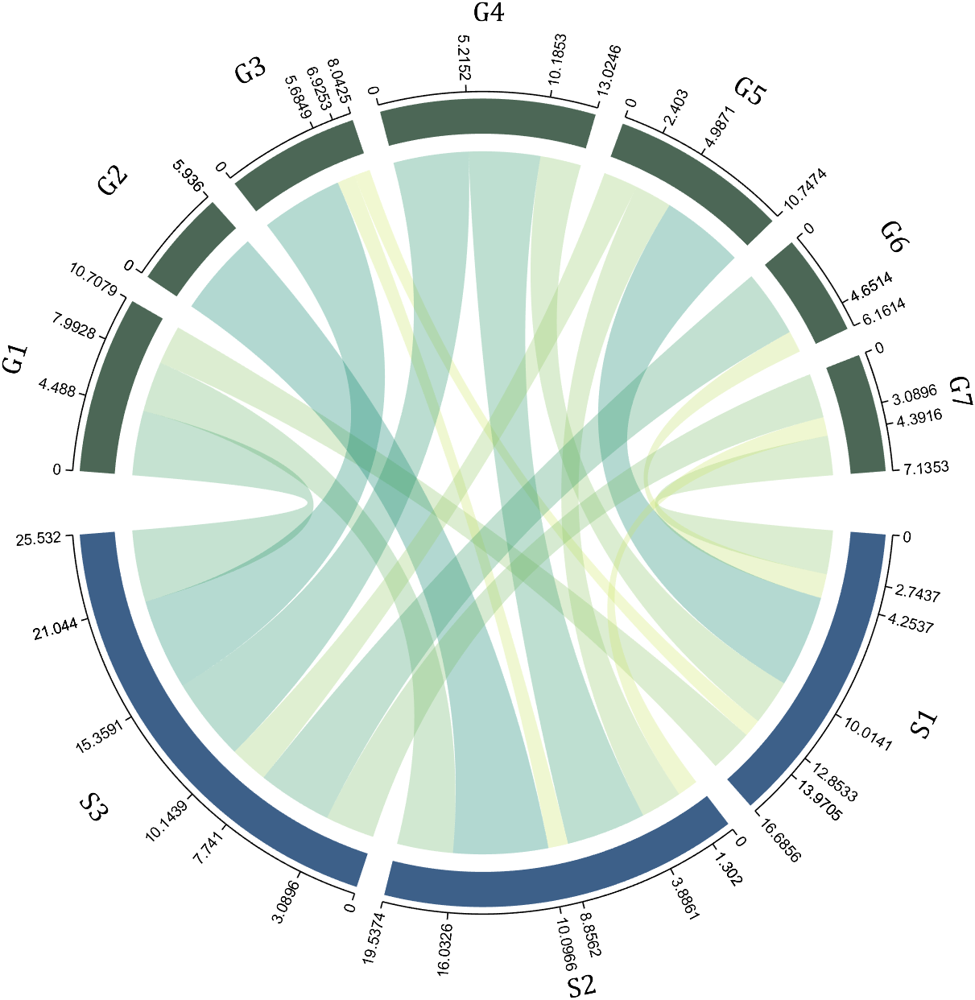
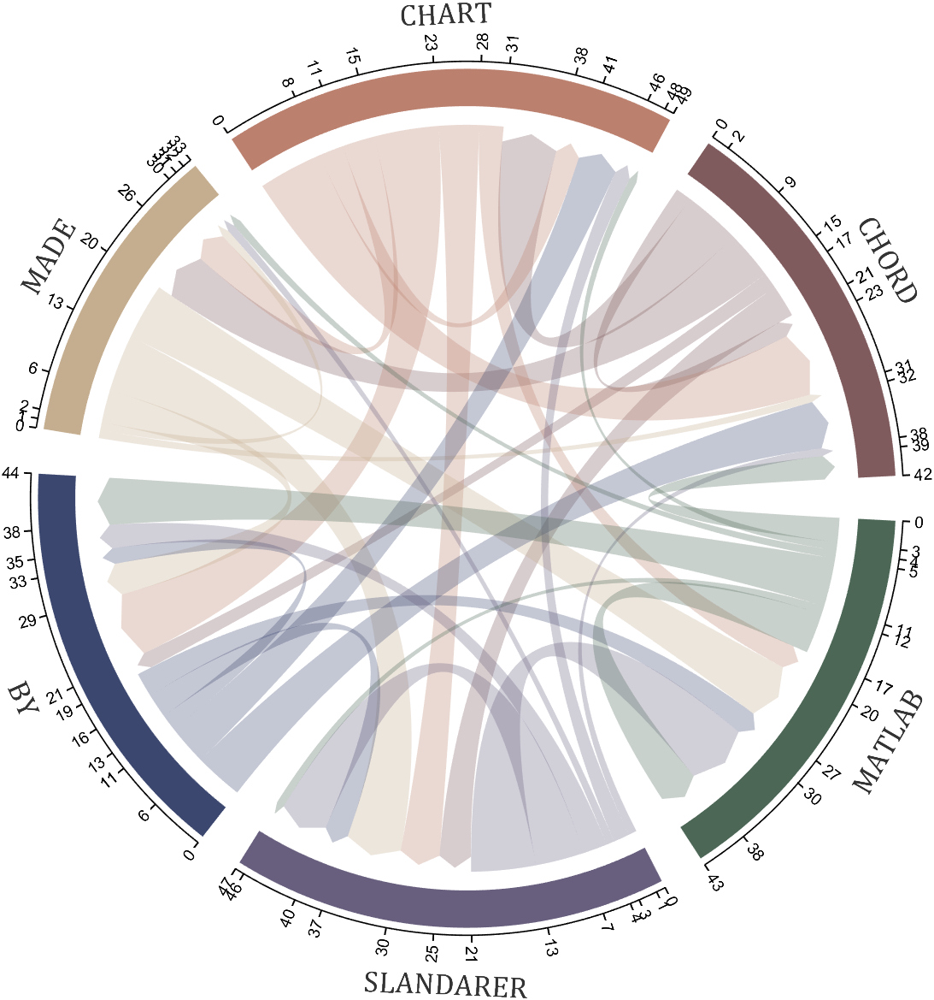

# MATLAB chord chart

## chordchart



```matlab
dataMat=[2 0 1 2 5 1 2;
         3 5 1 4 2 0 1;
         4 0 5 5 2 4 3];
dataMat=dataMat+rand(3,7);
dataMat(dataMat<1)=0;

colName={'G1','G2','G3','G4','G5','G6','G7'};
rowName={'S1','S2','S3'};

CC=chordChart(dataMat,'rowName',rowName,'colName',colName);
CC=CC.draw();
CC.setFont('FontSize',17,'FontName','Cambria')

% 显示刻度和数值
% Displays scales and numeric values
CC.tickState('on')
CC.tickLabelState('on')

% 调节标签半径
% Adjustable Label radius
CC.setLabelRadius(1.4);
```

#### fileexchange下载链接
Zhaoxu Liu (2022). chord chart 弦图 (https://www.mathworks.com/matlabcentral/fileexchange/116550-chord-chart), MATLAB Central File Exchange. 检索来源 2022/11/9.

#### 免登录网盘链接
链接：https://pan.baidu.com/s/1ameiL3ben43gVVu_hV7SGg?pwd=slan \
提取码：slan 

___
## biChordChart



```matlab
dataMat=randi([0,8],[6,6]);

% 添加标签名称
NameList={'CHORD','CHART','MADE','BY','SLANDARER','MATLAB'};
BCC=biChordChart(dataMat,'Label',NameList,'Arrow','on');
BCC=BCC.draw(); 

% 添加刻度
BCC.tickState('on')

% 修改字体，字号及颜色
BCC.setFont('FontName','Cambria','FontSize',17,'Color',[.2,.2,.2])

% version 1.1.0更新
% 函数labelRotate用来旋转标签
% The function labelRatato is used to rotate the label
% BCC.labelRotate('on')

BCC.setLabelRadius(1.3);
BCC.tickLabelState('on')
```

#### fileexchange下载链接
Zhaoxu Liu / slandarer (2022). Digraph chord chart 有向弦图 (https://www.mathworks.com/matlabcentral/fileexchange/121043-digraph-chord-chart), MATLAB Central File Exchange. 检索来源 2022/11/22.

#### 免登录网盘链接
链接：https://pan.baidu.com/s/1deu8iiel_NJJUITzn5DUYA?pwd=slan \
提取码：slan 

