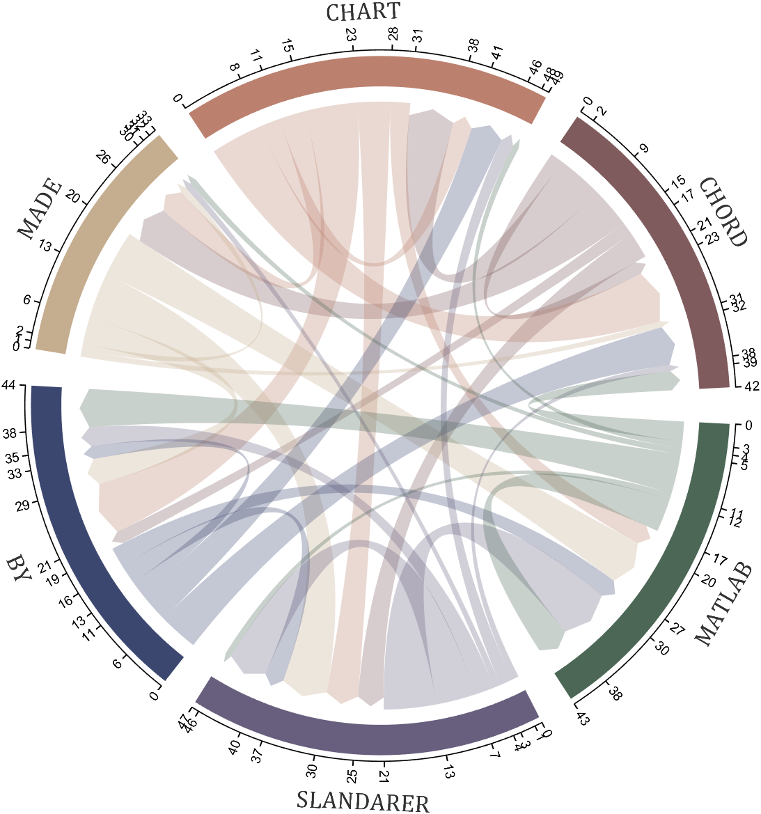
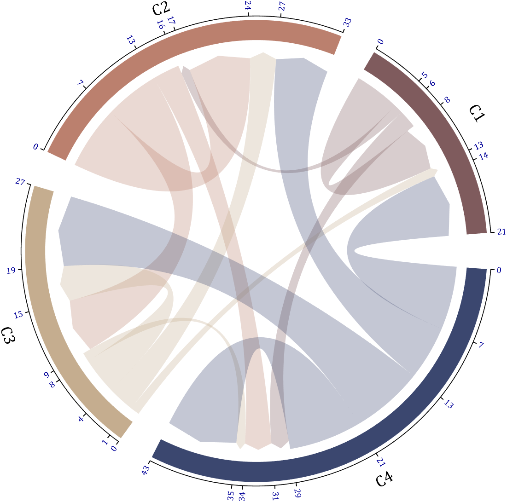

# 绘制效果




___
# 详细教程
## 0 数据准备
数据应准备全是非负数值的方形矩阵，矩阵第i行第j列表示由类i流向类j，第j行第i列表示由类j流向类i,也就是说矩阵是非对称的，可以同时统计两个类互相的数据流动,这里构造个随机数矩阵：
```matlab
dataMat=randi([0,8],[6,6]);
```
## 1 基础绘图
两行代码搞定~
```matlab
dataMat=randi([0,8],[6,6]);

BCC=biChordChart(dataMat);
BCC=BCC.draw(); 
```


## 2 方向箭头
两侧都是弧形仅仅靠颜色不容易区分流入还是流出，因此可在创建对象时将`Arrow`属性设置为`'on'`：
```matlab
dataMat=randi([0,8],[6,6]);

BCC=biChordChart(dataMat,'Arrow','on');
BCC=BCC.draw(); 
```


## 3 绘图间隙

通过`Sep`属性可调整绘图间隙，例如设置为特别小的1/120：
```matlab
dataMat=randi([0,8],[6,6]);

BCC=biChordChart(dataMat,'Arrow','on','Sep',1/120);
BCC=BCC.draw(); 
```


## 4 添加刻度
通过`tickState`函数设置显示或者隐藏刻度：
```matlab
dataMat=randi([0,8],[6,6]);

BCC=biChordChart(dataMat,'Arrow','on');
BCC=BCC.draw(); 

% 添加刻度
BCC.tickState('on')
```


## 5 修改标签
标签名字默认为`C1,C2,C3,...`可以通过`Label`属性进行修改例如：
```matlab
dataMat=randi([0,8],[6,6]);

% 添加标签名称
NameList={'CHORD','CHART','MADE','BY','SLANDARER','MATLAB'};
BCC=biChordChart(dataMat,'Label',NameList,'Arrow','on');
BCC=BCC.draw();
```


## 6 旋转标签
懒得集成进函数里了，请使用以下这段稍显麻烦的代码：
```matlab
dataMat=randi([0,8],[6,6]);

% 添加标签名称
NameList={'CHORD','CHART','MADE','BY','SLANDARER','MATLAB'};
BCC=biChordChart(dataMat,'Label',NameList,'Arrow','on');
BCC=BCC.draw(); 

% 添加刻度
BCC.tickState('on')

% 修改字体，字号及颜色
BCC.setFont('FontName','Cambria','FontSize',17,'Color',[.2,.2,.2])

% version 1.1.0更新
% 函数labelRotate用来旋转标签
% The function labelRatato is used to rotate the label
BCC.labelRotate('on')
```


## 7 颜色的设置

可在draw绘图之前设置`CData`属性修改颜色，例如：
```matlab
dataMat=randi([0,8],[6,6]);

ColorList=[127,91,93;153,66,83;95,127,95;9,14,10;78,70,83;0,0,0]./255;
BCC=biChordChart(dataMat,'Arrow','on','CData',ColorList);
BCC=BCC.draw();
```

```matlab
dataMat=randi([0,8],[6,6]);

BCC=biChordChart(dataMat,'Arrow','on','CData',bone(9));
BCC=BCC.draw();
```


值得一提的是如果`CData`设置为空集，则会随机生成颜色：
```matlab
dataMat=randi([0,8],[6,6]);

BCC=biChordChart(dataMat,'Arrow','on','CData',[]);
BCC=BCC.draw();
```


## 8 弧块及弦属性设置
通过 
+ BCC.setSquareN
+ BCC.setChordN

设置第n个弧块或第n类弦的属性，`Patch`对象具有的属性均可被设置，比如如果没提前定义颜色，可以比较麻烦的修改颜色：
```matlab
dataMat=randi([0,8],[6,6]);

BCC=biChordChart(dataMat,'Arrow','on');
BCC=BCC.draw();

ColorList=lines(6);
for i=1:6
    BCC.setSquareN(i,'FaceColor',ColorList(i,:))
    BCC.setChordN(i,'FaceColor',ColorList(i,:))
end
```


使用函数：
+ setChordMN

函数可以单独修饰类m到类n的属性，例如找到比较大的弦并将边缘标记为红色：
```matlab
dataMat=randi([0,8],[6,6]);

BCC=biChordChart(dataMat,'Arrow','on');
BCC=BCC.draw();

% 标记最大值弦
[m,n]=find(dataMat==max(max(dataMat)));
for i=1:length(m)
    BCC.setChordMN(m(i),n(i),'EdgeColor',[.8,0,0],'LineWidth',2)
end
```


## 9 字体设置
通过:
+ setFont

函数进行字体设置：
```matlab
dataMat=randi([0,8],[6,6]);

BCC=biChordChart(dataMat,'Arrow','on');
BCC=BCC.draw();

% 修改字体，字号及颜色
BCC.setFont('FontName','Cambria','FontSize',30,'Color',[0,0,.8])
```

___

## 10 添加刻度标签,调整类标签距离
通过：

+ setLabelRadius 调整类标签距离
+ tickLabelState 调整刻度标签开关
+ setTickFont 调整刻度标签字体

```matlab
dataMat=[5 1 0 2;
         0 7 6 3;
         1 3 4 1;
         7 6 8 8];
BCC=biChordChart(dataMat,'Arrow','on');
BCC=BCC.draw();

% 修改字体，字号及颜色
BCC.setFont('FontName','Cambria','FontSize',17)

% 调节标签半径
% Adjustable Label radius
BCC.setLabelRadius(1.3);

% 显示刻度和数值
% Displays scales and numeric values
BCC.tickState('on')
BCC.tickLabelState('on')

BCC.setTickFont('FontName','Cambria','Color',[0,0,.6])


figure()
dataMat=[5.213 1.231 0.000 2.835;
         0.000 7.674 6.565 3.085;
         1.534 3.676 4.467 1.654;
         7.647 6.111 8.772 8.561];
BCC=biChordChart(dataMat,'Arrow','on');
BCC=BCC.draw();

% 修改字体，字号及颜色
BCC.setFont('FontName','Cambria','FontSize',17)

% 调节标签半径
% Adjustable Label radius
BCC.setLabelRadius(1.4);

% 显示刻度和数值
% Displays scales and numeric values
BCC.tickState('on')
BCC.tickLabelState('on')
```


___
## 11 刻度标签格式自定义
需要一个输入数值输出字符串的匿名函数，通过setTickLabelFormat函数可设置格式，比如科学计数法：
```matlab
dataMat=[5.213 1.231 0.000 2.835;
         0.000 7.674 6.565 3.085;
         1.534 3.676 4.467 1.654;
         7.647 6.111 8.772 8.561].*1e15;
BCC=biChordChart(dataMat,'Arrow','on');
BCC=BCC.draw();

% 修改字体，字号及颜色
BCC.setFont('FontName','Cambria','FontSize',17)

% 调节标签半径
% Adjustable Label radius
BCC.setLabelRadius(1.4);

% 显示刻度和数值
% Displays scales and numeric values
BCC.tickState('on')
BCC.tickLabelState('on')


% 调整数值字符串格式
% Adjust numeric string format
BCC.setTickLabelFormat(@(x)sprintf('%0.1e',x))
```

___
# 封面绘制
## 封面1
```matlab
dataMat=randi([0,8],[6,6]);

% 添加标签名称
NameList={'CHORD','CHART','MADE','BY','SLANDARER','MATLAB'};
BCC=biChordChart(dataMat,'Label',NameList,'Arrow','on');
BCC=BCC.draw(); 

% 添加刻度
BCC.tickState('on')

% 修改字体，字号及颜色
BCC.setFont('FontName','Cambria','FontSize',17,'Color',[.2,.2,.2])

% version 1.1.0更新
% 函数labelRotate用来旋转标签
% The function labelRatato is used to rotate the label
% BCC.labelRotate('on')

BCC.setLabelRadius(1.3);
BCC.tickLabelState('on')
```


非常短的代码就能绘制出效果不错的图！！

# 完整代码
```matlab
classdef biChordChart
% @author : slandarer
% 公众号  : slandarer随笔
% 知乎    : slandarer
% -------------------------------------------------------------------------
% Zhaoxu Liu / slandarer (2023). Digraph chord chart 有向弦图 
% (https://www.mathworks.com/matlabcentral/fileexchange/121043-digraph-chord-chart), 
% MATLAB Central File Exchange. 检索来源 2023/4/1.
%
% =========================================================================
% 使用示例：
% -------------------------------------------------------------------------
% dataMat=randi([0,8],[6,6]);
% 
% BCC=biChordChart(dataMat,'Arrow','on');
% BCC=BCC.draw();
% 
% % 添加刻度
% BCC.tickState('on')
% 
% % 修改字体，字号及颜色
% BCC.setFont('FontName','Cambria','FontSize',17)
% =========================================================================
% 版本更新：
% -------------------------------------------------------------------------
% # version 1.1.0
% + 增添了可调节标签半径的属性'LRadius'
%   Added attribute 'LRadius' with adjustable Label radius
% + 增添了可调节标签旋转的属性'LRotate'及函数 `labelRatato`(demo3)
%   Added attribute 'LRotate' and function `labelRatato` with adjustable Label rotate(demo3)
% + 可使用函数`tickLabelState`显示刻度标签(demo4)
%   Use function `tickLabelState` to display tick labels(demo4)

    properties
        ax
        arginList={'Label','Sep','Arrow','CData','LRadius','LRotate'}
        dataMat     % 数值矩阵
        Label={}    % 标签文本
        % -----------------------------------------------------------
        squareHdl     % 绘制方块的图形对象矩阵
        nameHdl       % 绘制下方文本的图形对象矩阵
        chordMatHdl   % 绘制弦的图形对象矩阵
        thetaTickHdl  % 刻度句柄
        RTickHdl      % 轴线句柄
        thetaTickLabelHdl

        thetaSet=[];meanThetaSet;rotationSet;thetaFullSet
        Sep;Arrow;CData;LRadius=1.28;LRotate='off'
    end

    methods
        function obj=biChordChart(varargin)
            obj.Sep=1/10;
            obj.Arrow='off';
            obj.CData=[127,91,93;187,128,110;197,173,143;59,71,111;104,95,126;76,103,86;112,112,124;
                72,39,24;197,119,106;160,126,88;238,208,146]./255;
            if isa(varargin{1},'matlab.graphics.axis.Axes')
                obj.ax=varargin{1};varargin(1)=[];
            else
                obj.ax=gca;
            end  
            obj.ax.NextPlot='add';
            obj.dataMat=varargin{1};varargin(1)=[];
            % 获取其他数据
            for i=1:2:(length(varargin)-1)
                tid=ismember(obj.arginList,varargin{i});
                if any(tid)
                obj.(obj.arginList{tid})=varargin{i+1};
                end
            end
            % 名称标签预设
            if isempty(obj.Label)||length(obj.Label)<size(obj.dataMat,1)
                for i=1:size(obj.dataMat,1)
                    obj.Label{i}=['C',num2str(i)];
                end
            end
            % 调整不合理间隙
            if obj.Sep>1/10
                obj.Sep=1/10;
            end
            % 调整颜色数量
            if size(obj.CData,1)<size(obj.dataMat,1)
                obj.CData=[obj.CData;rand([size(obj.dataMat,1),3]).*.5+ones([size(obj.dataMat,1),3]).*.5];
            end
            % 调整对角线
            for i=1:size(obj.dataMat,1)
                obj.dataMat(i,i)=abs(obj.dataMat(i,i));
            end
            % 调整标签间距
            if obj.LRadius>2||obj.LRadius<1.2
                obj.LRadius=1.28;
            end
            help biChordChart
        end

        function obj=draw(obj)
            obj.ax.XLim=[-1.38,1.38];
            obj.ax.YLim=[-1.38,1.38];
            obj.ax.XTick=[];
            obj.ax.YTick=[];
            obj.ax.XColor='none';
            obj.ax.YColor='none';
            obj.ax.PlotBoxAspectRatio=[1,1,1];
            % 计算比例
            numC=size(obj.dataMat,1);
            ratioC1=sum(abs(obj.dataMat),2)./sum(sum(abs(obj.dataMat)));
            ratioC2=sum(abs(obj.dataMat),1)./sum(sum(abs(obj.dataMat)));
            ratioC=(ratioC1'+ratioC2)./2;
            ratioC=[0,ratioC];

            sepLen=(2*pi*obj.Sep)./numC;
            baseLen=2*pi*(1-obj.Sep);
            % 绘制方块
            for i=1:numC
                theta1=sepLen/2+sum(ratioC(1:i))*baseLen+(i-1)*sepLen;
                theta2=sepLen/2+sum(ratioC(1:i+1))*baseLen+(i-1)*sepLen;
                theta=linspace(theta1,theta2,100);
                X=cos(theta);Y=sin(theta);
                obj.squareHdl(i)=fill([1.05.*X,1.15.*X(end:-1:1)],[1.05.*Y,1.15.*Y(end:-1:1)],...
                    obj.CData(i,:),'EdgeColor','none');
                theta3=(theta1+theta2)/2;
                obj.meanThetaSet(i)=theta3;
                rotation=theta3/pi*180;
                if rotation>0&&rotation<180
                    obj.nameHdl(i)=text(cos(theta3).*obj.LRadius,sin(theta3).*obj.LRadius,obj.Label{i},'FontSize',14,'FontName','Arial',...
                    'HorizontalAlignment','center','Rotation',-(.5*pi-theta3)./pi.*180,'Tag','BiChordLabel');
                    obj.rotationSet(i)=-(.5*pi-theta3)./pi.*180;
                else
                    obj.nameHdl(i)=text(cos(theta3).*obj.LRadius,sin(theta3).*obj.LRadius,obj.Label{i},'FontSize',14,'FontName','Arial',...
                    'HorizontalAlignment','center','Rotation',-(1.5*pi-theta3)./pi.*180,'Tag','BiChordLabel');
                    obj.rotationSet(i)=-(1.5*pi-theta3)./pi.*180;
                end
                obj.RTickHdl(i)=plot(cos(theta).*1.17,sin(theta).*1.17,'Color',[0,0,0],'LineWidth',.8,'Visible','off');
            end

            for i=1:numC
                for j=1:numC
                    theta_i_1=sepLen/2+sum(ratioC(1:i))*baseLen+(i-1)*sepLen;
                    theta_i_2=sepLen/2+sum(ratioC(1:i+1))*baseLen+(i-1)*sepLen;
                    theta_i_3=theta_i_1+(theta_i_2-theta_i_1).*sum(abs(obj.dataMat(:,i)))./(sum(abs(obj.dataMat(:,i)))+sum(abs(obj.dataMat(i,:))));

                    theta_j_1=sepLen/2+sum(ratioC(1:j))*baseLen+(j-1)*sepLen;
                    theta_j_2=sepLen/2+sum(ratioC(1:j+1))*baseLen+(j-1)*sepLen;
                    theta_j_3=theta_j_1+(theta_j_2-theta_j_1).*sum(abs(obj.dataMat(:,j)))./(sum(abs(obj.dataMat(:,j)))+sum(abs(obj.dataMat(j,:))));

                    ratio_i_1=obj.dataMat(i,:);ratio_i_1=[0,ratio_i_1./sum(ratio_i_1)];
                    ratio_j_2=obj.dataMat(:,j)';ratio_j_2=[0,ratio_j_2./sum(ratio_j_2)];
                    if true
                        theta1=theta_i_2+(theta_i_3-theta_i_2).*sum(ratio_i_1(1:j));
                        theta2=theta_i_2+(theta_i_3-theta_i_2).*sum(ratio_i_1(1:j+1));
                        theta3=theta_j_3+(theta_j_1-theta_j_3).*sum(ratio_j_2(1:i));
                        theta4=theta_j_3+(theta_j_1-theta_j_3).*sum(ratio_j_2(1:i+1));

                        tPnt1=[cos(theta1),sin(theta1)];
                        tPnt2=[cos(theta2),sin(theta2)];
                        tPnt3=[cos(theta3),sin(theta3)];
                        tPnt4=[cos(theta4),sin(theta4)];
                        obj.thetaSet=[obj.thetaSet;theta1;theta2;theta3;theta4];
                        obj.thetaFullSet(i,j)=theta1;
                        obj.thetaFullSet(i,j+1)=theta2;
                        obj.thetaFullSet(j,i+numC)=theta3;
                        obj.thetaFullSet(j,i+numC+1)=theta4;
                        if strcmp(obj.Arrow,'off')
                            % 计算贝塞尔曲线
                            tLine1=bezierCurve([tPnt1;0,0;tPnt4],200);
                            tLine2=bezierCurve([tPnt2;0,0;tPnt3],200);
                            tline3=[cos(linspace(theta2,theta1,100))',sin(linspace(theta2,theta1,100))'];
                            tline4=[cos(linspace(theta4,theta3,100))',sin(linspace(theta4,theta3,100))'];
                        else
                            % 计算贝塞尔曲线
                            tLine1=bezierCurve([tPnt1;0,0;tPnt4.*.96],200);
                            tLine2=bezierCurve([tPnt2;0,0;tPnt3.*.96],200);
                            tline3=[cos(linspace(theta2,theta1,100))',sin(linspace(theta2,theta1,100))'];
                            tline4=[cos(theta4).*.96,sin(theta4).*.96;
                                cos(theta3/2+theta4/2).*.99,sin(theta3/2+theta4/2).*.99;
                                cos(theta3).*.96,sin(theta3).*.96];
                        end
                        obj.chordMatHdl(i,j)=fill([tLine1(:,1);tline4(:,1);tLine2(end:-1:1,1);tline3(:,1)],...
                            [tLine1(:,2);tline4(:,2);tLine2(end:-1:1,2);tline3(:,2)],...
                            obj.CData(i,:),'FaceAlpha',.3,'EdgeColor','none');
                    else
                    end
                end
            end
            % 绘制刻度线
            tickX=[cos(obj.thetaSet).*1.17,cos(obj.thetaSet).*1.19,nan.*obj.thetaSet].';
            tickY=[sin(obj.thetaSet).*1.17,sin(obj.thetaSet).*1.19,nan.*obj.thetaSet].';
            obj.thetaTickHdl=plot(tickX(:),tickY(:),'Color',[0,0,0],'LineWidth',.8,'Visible','off');
            % version 1.1.0 更新部分
            for i=1:numC
                cumsumV=[0,cumsum([obj.dataMat(i,:),obj.dataMat(:,i).'])];
                for j=1:(2*numC+1)
                    rotation=obj.thetaFullSet(i,j)/pi*180;
                    if rotation>90&&rotation<270
                        rotation=rotation+180;
                        obj.thetaTickLabelHdl(i,j)=text(cos(obj.thetaFullSet(i,j)).*1.2,sin(obj.thetaFullSet(i,j)).*1.2,num2str(cumsumV(j)),...
                            'Rotation',rotation,'HorizontalAlignment','right','FontSize',9,'FontName','Arial','Visible','off','UserData',cumsumV(j));
                    else
                        obj.thetaTickLabelHdl(i,j)=text(cos(obj.thetaFullSet(i,j)).*1.2,sin(obj.thetaFullSet(i,j)).*1.2,num2str(cumsumV(j)),...
                            'Rotation',rotation,'FontSize',9,'FontName','Arial','Visible','off','UserData',cumsumV(j));
                    end
                end
            end

            % 贝塞尔函数
            function pnts=bezierCurve(pnts,N)
                t=linspace(0,1,N);
                p=size(pnts,1)-1;
                coe1=factorial(p)./factorial(0:p)./factorial(p:-1:0);
                coe2=((t).^((0:p)')).*((1-t).^((p:-1:0)'));
                pnts=(pnts'*(coe1'.*coe2))';
            end

            obj.labelRotate(obj.LRotate)
        end
        % -----------------------------------------------------------------
        % 方块属性设置
        function setSquareN(obj,n,varargin)
            set(obj.squareHdl(n),varargin{:});
        end
        % -----------------------------------------------------------------
        % 批量弦属性设置
        function setChordN(obj,n,varargin)
            for i=n
                for j=1:size(obj.dataMat,2)
                    set(obj.chordMatHdl(i,j),varargin{:});
                end
            end
        end
        % -----------------------------------------------------------------
        % 单独弦属性设置
        function setChordMN(obj,m,n,varargin)
            set(obj.chordMatHdl(m,n),varargin{:});
        end
        % -----------------------------------------------------------------
        % 字体设置
        function setFont(obj,varargin)
            for i=1:size(obj.dataMat,1)
                set(obj.nameHdl(i),varargin{:});
            end
        end
        function setTickFont(obj,varargin)
            for m=1:size(obj.thetaFullSet,1)
                for n=1:size(obj.thetaFullSet,2)
                    set(obj.thetaTickLabelHdl(m,n),varargin{:})
                end
            end
        end
        % version 1.1.0 更新部分
        % 标签文字距离设置
        function obj=setLabelRadius(obj,Radius)
            obj.LRadius=Radius;
            for i=1:size(obj.dataMat,1)
                set(obj.nameHdl(i),'Position',[cos(obj.meanThetaSet(i)),sin(obj.meanThetaSet(i))].*obj.LRadius);
            end
        end
        % version 1.1.0 更新部分
        % 标签旋转状态设置
        function labelRotate(obj,Rotate)
            obj.LRotate=Rotate;
            for i=1:size(obj.dataMat,1)
                set(obj.nameHdl(i),'HorizontalAlignment','center','Rotation',obj.rotationSet(i))
            end
            if isequal(obj.LRotate,'on')
            textHdl=findobj(obj.ax,'Tag','BiChordLabel');
            for i=1:length(textHdl)
                if textHdl(i).Rotation<-90
                    textHdl(i).Rotation=textHdl(i).Rotation+180;
                end
                switch true
                    case textHdl(i).Rotation<0&&textHdl(i).Position(2)>0
                        textHdl(i).Rotation=textHdl(i).Rotation+90;
                        textHdl(i).HorizontalAlignment='left';
                    case textHdl(i).Rotation>0&&textHdl(i).Position(2)>0
                        textHdl(i).Rotation=textHdl(i).Rotation-90;
                        textHdl(i).HorizontalAlignment='right';
                    case textHdl(i).Rotation<0&&textHdl(i).Position(2)<0
                        textHdl(i).Rotation=textHdl(i).Rotation+90;
                        textHdl(i).HorizontalAlignment='right';
                    case textHdl(i).Rotation>0&&textHdl(i).Position(2)<0
                        textHdl(i).Rotation=textHdl(i).Rotation-90;
                        textHdl(i).HorizontalAlignment='left';
                end
            end
            end
        end
        % -----------------------------------------------------------------
        % 刻度开关
        function tickState(obj,state)
            for i=1:size(obj.dataMat,1)
                set(obj.RTickHdl(i),'Visible',state);
            end
            set(obj.thetaTickHdl,'Visible',state);
        end
        % version 1.1.0 更新部分
        function tickLabelState(obj,state)
            for m=1:size(obj.thetaFullSet,1)
                for n=1:size(obj.thetaFullSet,2)
                    set(obj.thetaTickLabelHdl(m,n),'Visible',state)
                end
            end
        end
        function setTickLabelFormat(obj,func)
            for m=1:size(obj.thetaFullSet,1)
                for n=1:size(obj.thetaFullSet,2)
                    tStr=func(get(obj.thetaTickLabelHdl(m,n),'UserData'));
                    set(obj.thetaTickLabelHdl(m,n),'String',tStr)
                end
            end
        end
    end
% @author : slandarer
% 公众号  : slandarer随笔
% 知乎    : slandarer
% -------------------------------------------------------------------------
% Zhaoxu Liu / slandarer (2023). Digraph chord chart 有向弦图 
% (https://www.mathworks.com/matlabcentral/fileexchange/121043-digraph-chord-chart), 
% MATLAB Central File Exchange. 检索来源 2023/4/1.
end