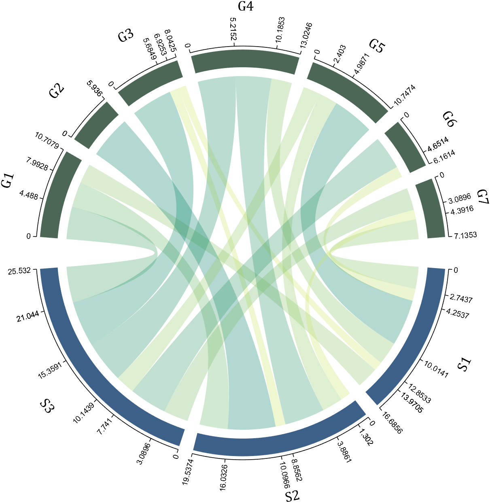

# 封面图




___

# 使用教程
## 1 数据格式

数据要求为全部数值大于等于0的数值矩阵，或者`table`数组，或者数值矩阵+行列名元胞数组，首先举个数值矩阵的例子：
### 数值矩阵
```matlab
dataMat=randi([0,5],[5,4]); 

% 绘图
CC=chordChart(dataMat);
CC=CC.draw();
```


这样由于没个各个对象命名，因此会自动命名为`Rn`和`Cn`

### 数值矩阵+行列名元胞数组
这是最推荐的一种格式：
```matlab
dataMat=[2 0 1 2 5 1 2;
         3 5 1 4 2 0 1;
         4 0 5 5 2 4 3];
colName={'G1','G2','G3','G4','G5','G6','G7'};
rowName={'S1','S2','S3'};

CC=chordChart(dataMat,'rowName',rowName,'colName',colName);
CC=CC.draw();
```


`rowName`要和矩阵的行相同大小\
`colName`要和矩阵的列相同大小\
对于本列子来说第2行第3列数值是1，就说明有一份能量从`S1`流向`G3`，也就在这俩之间需要画单位宽度的弦。

### table 数组
需要使用如下格式的table数组：
```matlab
% ans =
% 
%   3×7 table
% 
%           G1    G2    G3    G4    G5    G6    G7
%           __    __    __    __    __    __    __
% 
%     S1    2     0     1     2     5     1     2 
%     S2    3     5     1     4     2     0     1 
%     S3    4     0     5     5     2     4     3 
```
当然，如果各个行没有命名的话依旧会自动命名的。
___
## 2 修饰弦
### 弦的批量修饰
弦的批量修饰可以使用`setChordProp`函数，一切Patch对象所具有的属性均可以被修饰，举个例子(修饰一下弦的颜色，边缘颜色，边缘线形状等)：
```matlab
CC.setChordProp('EdgeColor',[.3,.3,.3],'LineStyle','--',...
    'LineWidth',.1,'FaceColor',[.3,.3,.3])
```


### 弦的单独修饰
弦的批量修饰可以使用`setChordMN`函数，其中m,n值是和原始数值矩阵的行列完全对应的,举个例子(把`S2`流向`G4`的弦颜色更改为红色)：
```matlab
CC.setChordMN(2,4,'FaceColor',[1,0,0])
```


### 弦的颜色映射
使用`setChordColorByMap`函数进行颜色映射，
matlab 自带的`colormap`均可用：
或者也可自行放入一个n×3大小的颜色列表，程序会自动对其进行插值：举个例子：
```matlab
CC.setChordColorByMap(copper(100))
% colormap(copper(100))
```

___

## 3 圆弧状方块修饰
### 圆弧状方块批量修饰
使用
+ setSquareT_Prop
+ setSquareF_Prop

分别修饰上方方块和下方方块，一切Patch对象所具有的属性均可以被修饰，举个例子，上方方块批量修饰(改为黑色)：
```matlab
CC.setSquareT_Prop('FaceColor',[0,0,0])
```


### 圆弧状方块单独修饰
使用
+ setSquareT_N
+ setSquareF_N

分别修饰上方方块和下方方块，举个例子，上方第二个方块单独修饰(改为红色)：
```matlab
CC.setSquareT_N(2,'FaceColor',[.8,0,0])
```

___

## 4 字体调整
使用`setFont`函数对字体进行调整，所有text对象具有的属性均可以修饰，举个例子(更改文本的字号、字体和颜色)：
```matlab
CC.setFont('FontSize',17,'FontName','Cambria','Color',[0,0,.8])
```

___
## 5 显示和隐藏刻度
用法：
```matlab
CC.tickState('on')
% CC.tickState('off')
```


___
## 6 间隙
假如矩阵较大则绘图会比例失调：
```matlab
dataMat=randi([0,1],[20,10]); 
CC=chordChart(dataMat);
CC=CC.draw();
```

可修改其Sep属性:
```matlab
dataMat=randi([0,1],[20,10]); 
% use Sep to decrease space (separation)
% 使用 sep 减小空隙
CC=chordChart(dataMat,'Sep',1/120);
CC=CC.draw();
```

___
## 7 刻度标签
通过：

+ setLabelRadius 调整类标签距离
+ tickLabelState 调整刻度标签开关
+ setTickFont 调整刻度标签字体

```matlab
dataMat=[2 0 1 2 5 1 2;
         3 5 1 4 2 0 1;
         4 0 5 5 2 4 3];
colName={'G1','G2','G3','G4','G5','G6','G7'};
rowName={'S1','S2','S3'};

CC=chordChart(dataMat,'rowName',rowName,'colName',colName);
CC=CC.draw();
CC.setFont('FontSize',17,'FontName','Cambria')

% 显示刻度和数值
% Displays scales and numeric values
CC.tickState('on')
CC.tickLabelState('on')

CC.setTickFont('Color',[0,0,.8],'FontName','Cambria')

% 调节标签半径
% Adjustable Label radius
CC.setLabelRadius(1.3);


% figure()
% dataMat=[2 0 1 2 5 1 2;
%          3 5 1 4 2 0 1;
%          4 0 5 5 2 4 3];
% dataMat=dataMat+rand(3,7);
% dataMat(dataMat<1)=0;
% 
% CC=chordChart(dataMat,'rowName',rowName,'colName',colName);
% CC=CC.draw();
% CC.setFont('FontSize',17,'FontName','Cambria')
% 
% % 显示刻度和数值
% % Displays scales and numeric values
% CC.tickState('on')
% CC.tickLabelState('on')
% 
% % 调节标签半径
% % Adjustable Label radius
% CC.setLabelRadius(1.4);
```


___
## 8 刻度标签格式自定义
需要一个输入数值输出字符串的匿名函数，通过setTickLabelFormat函数可设置格式，比如科学计数法：
```matlab
dataMat=[2 0 1 2 5 1 2;
         3 5 1 4 2 0 1;
         4 0 5 5 2 4 3];
dataMat=dataMat+rand(3,7);
dataMat(dataMat<1)=0;
dataMat=dataMat.*1000;

CC=chordChart(dataMat);
CC=CC.draw();
CC.setFont('FontSize',17,'FontName','Cambria')

% 显示刻度和数值
% Displays scales and numeric values
CC.tickState('on')
CC.tickLabelState('on')

% 调节标签半径
% Adjustable Label radius
CC.setLabelRadius(1.4);

% 调整数值字符串格式
% Adjust numeric string format
CC.setTickLabelFormat(@(x)sprintf('%0.1e',x))

```


___
## 9 弦末端弧形块单独上色
```matlab
% demo8
% @author : slandarer
% 公众号  : slandarer随笔
% 知乎    : slandarer
rng(3)
dataMat = randi([1, 15], [7, 22]);
dataMat(dataMat < 11) = 0;
dataMat(1, sum(dataMat,1) == 0) = 15;
colName = {'A2M', 'FGA', 'FGB', 'FGG', 'F11', 'KLKB1', 'SERPINE1', 'VWF',...
           'THBD', 'TFPI', 'PLAT', 'SERPINA5', 'SERPIND1', 'F2', 'PLG', 'F12',...
           'SERPINC1', 'SERPINA1', 'PROS1', 'SERPINF2', 'F13A1', 'PROC'};
rowName = {'Lung', 'Spleen', 'Liver', 'Heart',...
           'Renal cortex', 'Renal medulla', 'Thyroid'};

figure('Units','normalized', 'Position',[.02, .05, .6, .85])
CC = chordChart(dataMat, 'rowName',rowName, 'colName',colName, 'Sep',1/80, 'LRadius',1.21);
CC = CC.draw();
CC.labelRotate('on')

% 单独设置每一个弦末端方块(Set individual end blocks for each chord)
% Use obj.setEachSquareF_Prop 
% or  obj.setEachSquareT_Prop
% F means from (blocks below)
% T means to   (blocks above)
CListT = [173,70,65; 79,135,136]./255;
% Upregulated:1 | Downregulated:2
Regulated = rand([7, 22]);
Regulated = (Regulated < .8) + 1;
for i = 1:size(Regulated, 1)
    for j = 1:size(Regulated, 2)
        CC.setEachSquareT_Prop(i, j, 'FaceColor', CListT(Regulated(i,j),:))
    end
end
% 绘制图例(Draw legend)
H1 = fill([0,1,0]+100, [1,0,1]+100, CListT(1,:), 'EdgeColor','none');
H2 = fill([0,1,0]+100, [1,0,1]+100, CListT(2,:), 'EdgeColor','none');
lgdHdl = legend([H1,H2], {'Upregulated','Downregulated'}, 'AutoUpdate','off', 'Location','best');
lgdHdl.ItemTokenSize = [12,12];
lgdHdl.Box = 'off';
lgdHdl.FontSize = 13;

% 修改下方方块颜色(Modify the color of the blocks below)
CListF=[128,108,171; 222,208,161; 180,196,229; 209,150,146; 175,201,166;
        134,156,118; 175,175,173]./255;
for i=1:7
    CC.setSquareF_N(i, 'FaceColor',CListF(i,:))
end
% 修改弦颜色(Modify chord color)
for i=1:7
    for j=1:22
        CC.setChordMN(i,j, 'FaceColor',CListF(i,:), 'FaceAlpha',.45)
    end
end
```
00004-0%20P8.png)

___
# 工具函数完整代码
```matlab
classdef chordChart < handle
% Copyright (c) 2022-2024, Zhaoxu Liu / slandarer
% =========================================================================
% @author : slandarer
% 公众号  : slandarer随笔
% 知乎    : slandarer
% -------------------------------------------------------------------------
% Zhaoxu Liu / slandarer (2024). chord chart 弦图 
% (https://www.mathworks.com/matlabcentral/fileexchange/116550-chord-chart), 
% MATLAB Central File Exchange. 检索来源 2024/3/31.
% =========================================================================
% 使用示例：
% -------------------------------------------------------------------------
% dataMat=[2 0 1 2 5 1 2;
%          3 5 1 4 2 0 1;
%          4 0 5 5 2 4 3];
% colName={'G1','G2','G3','G4','G5','G6','G7'};
% rowName={'S1','S2','S3'};
% 
% CC=chordChart(dataMat,'rowName',rowName,'colName',colName);
% CC=CC.draw()
% =========================================================================
% 版本更新：
% -------------------------------------------------------------------------
% # version 1.5.0
% + 修复了老版本 sum(....,[1,2])的bug
%   Fixed the bug of the old version(sum(....,[1,2]))
% + 增添了可调节方块间距的属性'Sep'
%   Added attribute 'Sep' with adjustable square spacing
% + 增添demo3 旋转标签角度示例(demo3)
%   demo3 is added to show how to rotate the label(demo3)
% -------------------------------------------------------------------------
% # version 1.7.0
% + 增添了可调节标签半径的属性'LRadius'
%   Added attribute 'LRadius' with adjustable Label radius
% + 增添了可调节标签旋转的属性'LRotate'及函数 `labelRatato`(demo3)
%   Added attribute 'LRotate' and function `labelRatato` with adjustable Label rotate(demo3)
% + 可直接使用`colormap`函数调整颜色(demo4)
%   Colors can be adjusted directly using the function `colormap`(demo4)
% + 可使用函数`tickLabelState`显示刻度标签(demo5)
%   Use function `tickLabelState` to display tick labels(demo5)
% -------------------------------------------------------------------------
% # version 2.1.0
% + 修复了老版本部分标签错误旋转的bug
%   Fixed a bug with incorrect rotation of some labels in older versions
% + 单独设置每一个弦末端方块(demo8)
%   Set individual end blocks for each chord(demo8)
%   Use obj.setEachSquareF_Prop 
%   or  obj.setEachSquareT_Prop
%   F means from (blocks below)
%   T means to   (blocks above)

    properties
        ax
        arginList={'colName','rowName','Sep','LRadius','LRotate'}
        chordTable  % table数组
        dataMat     % 数值矩阵
        colName={}; % 列名称
        rowName={}; % 行名称
        thetaSetF;meanThetaSetF;rotationF
        thetaSetT;meanThetaSetT;rotationT
        % -----------------------------------------------------------
        squareFHdl  % 绘制下方方块的图形对象矩阵
        squareTHdl  % 绘制下上方方块的图形对象矩阵
        squareFMatHdl % 流入拆分矩阵
        squareTMatHdl % 流入拆分矩阵

        nameFHdl    % 绘制下方文本的图形对象矩阵
        nameTHdl    % 绘制上方文本的图形对象矩阵
        chordMatHdl % 绘制弦的图形对象矩阵
        thetaTickFHdl % 刻度句柄
        thetaTickTHdl % 刻度句柄
        RTickFHdl % 轴线句柄
        RTickTHdl % 轴线句柄
        thetaTickLabelFHdl
        thetaTickLabelTHdl

        Sep;LRadius=1.28;LRotate='off'
    end

    methods
        function obj=chordChart(varargin)
            if isa(varargin{1},'matlab.graphics.axis.Axes')
                obj.ax=varargin{1};varargin(1)=[];
            else
                obj.ax=gca;
            end
            obj.ax.NextPlot='add';

            
            obj.dataMat=varargin{1};varargin(1)=[];
            if isa(obj.dataMat,'table')
            obj.chordTable=obj.dataMat;
                if isempty(obj.chordTable.Properties.RowNames)
                    for i=1:size(obj.chordTable.Variables,1)
                        obj.rowName{i}=['R',num2str(i)];
                    end
                end
            else

            obj.Sep=1/40;
            % 获取其他数据
            for i=1:2:(length(varargin)-1)
                tid=ismember(obj.arginList,varargin{i});
                if any(tid)
                obj.(obj.arginList{tid})=varargin{i+1};
                end
            end
            tzerocell{1,size(obj.dataMat,2)}=zeros(size(obj.dataMat,1),1);
            for i=1:size(obj.dataMat,2)
                tzerocell{1,i}=zeros(size(obj.dataMat,1),1);
            end
            if isempty(obj.colName)
                for i=1:size(obj.dataMat,2)
                    obj.colName{i}=['C',num2str(i)];
                end
            end
            if isempty(obj.rowName)
                for i=1:size(obj.dataMat,1)
                    obj.rowName{i}=['R',num2str(i)];
                end
            end
            if obj.Sep>1/40
                obj.Sep=1/40;
            end
            if obj.LRadius>2||obj.LRadius<1.2
                obj.LRadius=1.28;
            end


            % 创建table数组
            obj.chordTable=table(tzerocell{:});
            obj.chordTable.Variables=obj.dataMat;
            obj.chordTable.Properties.VariableNames=obj.colName;
            obj.chordTable.Properties.RowNames=obj.rowName;

            help chordChart
            end
        end

        function obj=draw(obj)
            obj.ax.XLim=[-1.38,1.38];
            obj.ax.YLim=[-1.38,1.38];
            obj.ax.XTick=[];
            obj.ax.YTick=[];
            obj.ax.XColor='none';
            obj.ax.YColor='none';
            obj.ax.PlotBoxAspectRatio=[1,1,1];

            % 计算绘图所用数值
            tDMat=obj.chordTable.Variables;
            tDFrom=obj.chordTable.Properties.RowNames;
            tDTo=obj.chordTable.Properties.VariableNames;

            tDMatUni=tDMat-min(min(tDMat));
            tDMatUni=tDMatUni./max(max(tDMatUni));

            sep1=1/20;
            sep2=obj.Sep;

            ratioF=sum(tDMat,2)./sum(sum(tDMat));
            ratioF=[0,ratioF'];
            ratioT=[0,sum(tDMat,1)./sum(sum(tDMat))];

            sepNumF=size(tDMat,1);
            sepNumT=size(tDMat,2);

            sepLen=pi*(1-2*sep1)*sep2;
            baseLenF=(pi*(1-sep1)-(sepNumF-1)*sepLen);
            baseLenT=(pi*(1-sep1)-(sepNumT-1)*sepLen);
            tColor=[61 96 137;76 103 86]./255;
            % 绘制下方方块
            for i=1:sepNumF
                theta1=2*pi-pi*sep1/2-sum(ratioF(1:i))*baseLenF-(i-1)*sepLen;
                theta2=2*pi-pi*sep1/2-sum(ratioF(1:i+1))*baseLenF-(i-1)*sepLen;
                theta=linspace(theta1,theta2,100);
                X=cos(theta);Y=sin(theta);
                obj.squareFHdl(i)=fill([1.05.*X,1.15.*X(end:-1:1)],[1.05.*Y,1.15.*Y(end:-1:1)],...
                    tColor(1,:),'EdgeColor','none');
                theta3=(theta1+theta2)/2;
                obj.meanThetaSetF(i)=theta3;
                obj.rotationF(i)=-(1.5*pi-theta3)./pi.*180;
                obj.nameFHdl(i)=text(cos(theta3).*obj.LRadius,sin(theta3).*obj.LRadius,tDFrom{i},'FontSize',12,'FontName','Arial',...
                    'HorizontalAlignment','center','Rotation',-(1.5*pi-theta3)./pi.*180,'Tag','ChordLabel');
                obj.RTickFHdl(i)=plot(cos(theta).*1.17,sin(theta).*1.17,'Color',[0,0,0],'LineWidth',.8,'Visible','off');
            end
            % 绘制上方方块
            for j=1:sepNumT
                theta1=pi-pi*sep1/2-sum(ratioT(1:j))*baseLenT-(j-1)*sepLen;
                theta2=pi-pi*sep1/2-sum(ratioT(1:j+1))*baseLenT-(j-1)*sepLen;
                theta=linspace(theta1,theta2,100);
                X=cos(theta);Y=sin(theta);
                obj.squareTHdl(j)=fill([1.05.*X,1.15.*X(end:-1:1)],[1.05.*Y,1.15.*Y(end:-1:1)],...
                    tColor(2,:),'EdgeColor','none');
                theta3=(theta1+theta2)/2;
                obj.meanThetaSetT(j)=theta3;
                obj.rotationT(j)=-(.5*pi-theta3)./pi.*180;
                obj.nameTHdl(j)=text(cos(theta3).*obj.LRadius,sin(theta3).*obj.LRadius,tDTo{j},'FontSize',12,'FontName','Arial',...
                    'HorizontalAlignment','center','Rotation',-(.5*pi-theta3)./pi.*180,'Tag','ChordLabel');
                obj.RTickTHdl(j)=plot(cos(theta).*1.17,sin(theta).*1.17,'Color',[0,0,0],'LineWidth',.8,'Visible','off');
            end

            % version 1.7.0 更新部分
            % colorFunc=colorFuncFactory(flipud(summer(50)));
            colormap(obj.ax,flipud(summer(50)))
            try clim([0,1]),catch,end
            try caxis([0,1]),catch,end
            % 绘制弦
            for i=1:sepNumF
                for j=sepNumT:-1:1
                    theta1=2*pi-pi*sep1/2-sum(ratioF(1:i))*baseLenF-(i-1)*sepLen;
                    theta2=2*pi-pi*sep1/2-sum(ratioF(1:i+1))*baseLenF-(i-1)*sepLen;

                    theta3=pi-pi*sep1/2-sum(ratioT(1:j))*baseLenT-(j-1)*sepLen;
                    theta4=pi-pi*sep1/2-sum(ratioT(1:j+1))*baseLenT-(j-1)*sepLen;

                    tRowV=tDMat(i,:);tRowV=[0,tRowV(end:-1:1)./sum(tRowV)];
                    tColV=tDMat(:,j)';tColV=[0,tColV./sum(tColV)];       

                    % 贝塞尔曲线断点计算
                    theta5=(theta2-theta1).*sum(tRowV(1:(sepNumT+1-j)))+theta1;
                    theta6=(theta2-theta1).*sum(tRowV(1:(sepNumT+2-j)))+theta1;
                    theta=linspace(theta5,theta6,100);
                    X=cos(theta);Y=sin(theta);
                    obj.squareFMatHdl(i,j)=fill([1.05.*X,1.15.*X(end:-1:1)],[1.05.*Y,1.15.*Y(end:-1:1)],...
                        tColor(2,:),'EdgeColor','none','Visible','off');

                    theta7=(theta3-theta4).*sum(tColV(1:i))+theta4;
                    theta8=(theta3-theta4).*sum(tColV(1:i+1))+theta4;
                    theta=linspace(theta7,theta8,100);
                    X=cos(theta);Y=sin(theta);
                    obj.squareTMatHdl(i,j)=fill([1.05.*X,1.15.*X(end:-1:1)],[1.05.*Y,1.15.*Y(end:-1:1)],...
                        tColor(2,:),'EdgeColor','none','Visible','off');

                    tPnt1=[cos(theta5),sin(theta5)];
                    tPnt2=[cos(theta6),sin(theta6)];
                    tPnt3=[cos(theta7),sin(theta7)];
                    tPnt4=[cos(theta8),sin(theta8)];

                    if j==sepNumT,obj.thetaSetF(i,1)=theta5;end
                    obj.thetaSetF(i,j+1)=theta6;
                    if i==1,obj.thetaSetT(1,j)=theta7;end
                    obj.thetaSetT(i+1,j)=theta8;

                    % 计算曲线
                    tLine1=bezierCurve([tPnt1;0,0;tPnt3],200);
                    tLine2=bezierCurve([tPnt2;0,0;tPnt4],200);
                    tline3=[cos(linspace(theta6,theta5,100))',sin(linspace(theta6,theta5,100))'];
                    tline4=[cos(linspace(theta7,theta8,100))',sin(linspace(theta7,theta8,100))'];
                    obj.chordMatHdl(i,j)=fill([tLine1(:,1);tline4(:,1);tLine2(end:-1:1,1);tline3(:,1)],...
                         [tLine1(:,2);tline4(:,2);tLine2(end:-1:1,2);tline3(:,2)],...
                         tDMatUni(i,j),'FaceAlpha',.3,'EdgeColor','none');
                    if tDMat(i,j)==0
                        set(obj.chordMatHdl(i,j),'Visible','off')
                    end     
                end

                % 绘制刻度线
                tX=[cos(obj.thetaSetF(i,:)).*1.17;cos(obj.thetaSetF(i,:)).*1.19;nan.*ones(1,sepNumT+1)];
                tY=[sin(obj.thetaSetF(i,:)).*1.17;sin(obj.thetaSetF(i,:)).*1.19;nan.*ones(1,sepNumT+1)];
                obj.thetaTickFHdl(i)=plot(tX(:),tY(:),'Color',[0,0,0],'LineWidth',.8,'Visible','off');
            end
            for j=1:sepNumT
                tX=[cos(obj.thetaSetT(:,j)').*1.17;cos(obj.thetaSetT(:,j)').*1.19;nan.*ones(1,sepNumF+1)];
                tY=[sin(obj.thetaSetT(:,j)').*1.17;sin(obj.thetaSetT(:,j)').*1.19;nan.*ones(1,sepNumF+1)];
                obj.thetaTickTHdl(j)=plot(tX(:),tY(:),'Color',[0,0,0],'LineWidth',.8,'Visible','off');
            end

            % version 1.7.0 更新部分
            obj.labelRotate(obj.LRotate)
            obj.thetaSetF(:,2:end)=obj.thetaSetF(:,end:-1:2);
            for m=1:size(obj.thetaSetF,1)
                cumsumV=[0,cumsum(obj.dataMat(m,end:-1:1))];
                for n=1:size(obj.thetaSetF,2)
                    rotation=obj.thetaSetF(m,n)/pi*180;
                    if rotation>90&&rotation<270
                        rotation=rotation+180;
                        obj.thetaTickLabelFHdl(m,n)=text(cos(obj.thetaSetF(m,n)).*1.2,sin(obj.thetaSetF(m,n)).*1.2,num2str(cumsumV(n)),...
                            'Rotation',rotation,'HorizontalAlignment','right','FontSize',9,'FontName','Arial','Visible','off','UserData',cumsumV(n));
                    else
                        obj.thetaTickLabelFHdl(m,n)=text(cos(obj.thetaSetF(m,n)).*1.2,sin(obj.thetaSetF(m,n)).*1.2,num2str(cumsumV(n)),...
                            'Rotation',rotation,'FontSize',9,'FontName','Arial','Visible','off','UserData',cumsumV(n));
                    end
                end
            end
            obj.thetaSetT(1:end,:)=obj.thetaSetT(end:-1:1,:);
            for m=1:size(obj.thetaSetT,2)
                cumsumV=[0,cumsum(obj.dataMat(end:-1:1,m)).'];
                for n=1:size(obj.thetaSetT,1)
                    rotation=obj.thetaSetT(n,m)/pi*180;
                    if rotation>90&&rotation<270
                        rotation=rotation+180;
                        obj.thetaTickLabelTHdl(m,n)=text(cos(obj.thetaSetT(n,m)).*1.2,sin(obj.thetaSetT(n,m)).*1.2,num2str(cumsumV(n)),...
                            'Rotation',rotation,'HorizontalAlignment','right','FontSize',9,'FontName','Arial','Visible','off','UserData',cumsumV(n));
                    else
                        obj.thetaTickLabelTHdl(m,n)=text(cos(obj.thetaSetT(n,m)).*1.2,sin(obj.thetaSetT(n,m)).*1.2,num2str(cumsumV(n)),...
                            'Rotation',rotation,'FontSize',9,'FontName','Arial','Visible','off','UserData',cumsumV(n));
                    end
                end
            end

            % 贝塞尔函数
            function pnts=bezierCurve(pnts,N)
                t=linspace(0,1,N);
                p=size(pnts,1)-1;
                coe1=factorial(p)./factorial(0:p)./factorial(p:-1:0);
                coe2=((t).^((0:p)')).*((1-t).^((p:-1:0)'));
                pnts=(pnts'*(coe1'.*coe2))';
            end

            % version 1.7.0 删除部分
            % 渐变色句柄生成函数
            % function colorFunc=colorFuncFactory(colorList)
            %     x=(0:size(colorList,1)-1)./(size(colorList,1)-1);
            %     y1=colorList(:,1);y2=colorList(:,2);y3=colorList(:,3);
            %     colorFunc=@(X)[interp1(x,y1,X,'linear')',interp1(x,y2,X,'linear')',interp1(x,y3,X,'linear')'];
            % end
        end
        % =================================================================
        % 批量弦属性设置
        function setChordProp(obj,varargin)
            tDMat=obj.chordTable.Variables;
            for i=1:size(tDMat,1)
                for j=1:size(tDMat,2)
                    set(obj.chordMatHdl(i,j),varargin{:});
                end
            end
        end
        % 单独弦属性设置
        function setChordMN(obj,m,n,varargin)
            set(obj.chordMatHdl(m,n),varargin{:});
        end
        % 根据colormap映射颜色
        function setChordColorByMap(obj,colorList)
            tDMat=obj.chordTable.Variables;
            tDMatUni=tDMat-min(min(tDMat));
            tDMatUni=tDMatUni./max(max(tDMatUni));

            colorFunc=colorFuncFactory(colorList);
            for i=1:size(tDMat,1)
                for j=1:size(tDMat,2)
                    set(obj.chordMatHdl(i,j),'FaceColor',colorFunc(tDMatUni(i,j)));
                end
            end
            % 渐变色句柄生成函数
            function colorFunc=colorFuncFactory(colorList)
                x=(0:size(colorList,1)-1)./(size(colorList,1)-1);
                y1=colorList(:,1);y2=colorList(:,2);y3=colorList(:,3);
                colorFunc=@(X)[interp1(x,y1,X,'linear')',interp1(x,y2,X,'linear')',interp1(x,y3,X,'linear')'];
            end
        end


        % -----------------------------------------------------------------
        % 批量上方方块属性设置
        function setSquareT_Prop(obj,varargin)
            tDMat=obj.chordTable.Variables;
            for j=1:size(tDMat,2)
                set(obj.squareTHdl(j),varargin{:});
            end
        end
        % 单独上方方块属性设置
        function setSquareT_N(obj,n,varargin)
            set(obj.squareTHdl(n),varargin{:});
        end

        % version 2.1.0 更新
        % 单独设置每一个弦末端方块
        function setEachSquareT_Prop(obj,m,n,varargin)
            set(obj.squareTMatHdl(m,n),'Visible','on',varargin{:})
        end
        function setEachSquareF_Prop(obj,m,n,varargin)
            set(obj.squareFMatHdl(m,n),'Visible','on',varargin{:})
        end


        % 批量下方方块属性设置
        function setSquareF_Prop(obj,varargin)
            tDMat=obj.chordTable.Variables;
            for i=1:size(tDMat,1)
                set(obj.squareFHdl(i),varargin{:});
            end
        end
        % 单独上方方块属性设置
        function setSquareF_N(obj,n,varargin)
            set(obj.squareFHdl(n),varargin{:});
        end
        % -----------------------------------------------------------------
        % 字体设置
        function setFont(obj,varargin)
            tDMat=obj.chordTable.Variables;
            for i=1:size(tDMat,1)
                set(obj.nameFHdl(i),varargin{:});
            end
            for j=1:size(tDMat,2)
                set(obj.nameTHdl(j),varargin{:});
            end 
        end
        function setTickFont(obj,varargin)
            for m=1:size(obj.thetaSetF,1)
                for n=1:size(obj.thetaSetF,2)
                    set(obj.thetaTickLabelFHdl(m,n),varargin{:})
                end
            end
            for m=1:size(obj.thetaSetT,2)
                for n=1:size(obj.thetaSetT,1)
                    set(obj.thetaTickLabelTHdl(m,n),varargin{:})
                end
            end
        end
        % version 1.7.0 更新部分
        % 标签文字距离设置
        function obj=setLabelRadius(obj,Radius)
            obj.LRadius=Radius;
            for i=1:length(obj.meanThetaSetF)
                set(obj.nameFHdl(i),'Position',[cos(obj.meanThetaSetF(i)),sin(obj.meanThetaSetF(i))].*obj.LRadius);
            end
            for j=1:length(obj.meanThetaSetT)
                set(obj.nameTHdl(j),'Position',[cos(obj.meanThetaSetT(j)),sin(obj.meanThetaSetT(j))].*obj.LRadius);
            end
        end
        % version 1.7.0 更新部分
        % 标签旋转状态设置
        function labelRotate(obj,Rotate)
            obj.LRotate=Rotate;
            for i=1:length(obj.meanThetaSetF)
                set(obj.nameFHdl(i),'Rotation',obj.rotationF(i),'HorizontalAlignment','center');
            end
            for j=1:length(obj.meanThetaSetT)
                set(obj.nameTHdl(j),'Rotation',obj.rotationT(j),'HorizontalAlignment','center');
            end
            if isequal(obj.LRotate,'on')
            textHdl=findobj(gca,'Tag','ChordLabel');
            for i=1:length(textHdl)
                if textHdl(i).Rotation<-90
                    textHdl(i).Rotation=textHdl(i).Rotation+180;
                end
                switch true
                    case textHdl(i).Rotation<0&&textHdl(i).Position(2)>0
                        textHdl(i).Rotation=textHdl(i).Rotation+90;
                        textHdl(i).HorizontalAlignment='left';
                    case textHdl(i).Rotation>=0&&textHdl(i).Position(2)>0
                        textHdl(i).Rotation=textHdl(i).Rotation-90;
                        textHdl(i).HorizontalAlignment='right';
                    case textHdl(i).Rotation<0&&textHdl(i).Position(2)<=0
                        textHdl(i).Rotation=textHdl(i).Rotation+90;
                        textHdl(i).HorizontalAlignment='right';
                    case textHdl(i).Rotation>=0&&textHdl(i).Position(2)<=0
                        textHdl(i).Rotation=textHdl(i).Rotation-90;
                        textHdl(i).HorizontalAlignment='left';
                end
            end
            end
        end
        % -----------------------------------------------------------------
        % 刻度开关
        function tickState(obj,state)
            tDMat=obj.chordTable.Variables;
            for i=1:size(tDMat,1)
                set(obj.thetaTickFHdl(i),'Visible',state);
                set(obj.RTickFHdl(i),'Visible',state);
            end
            for j=1:size(tDMat,2)
                set(obj.thetaTickTHdl(j),'Visible',state);
                set(obj.RTickTHdl(j),'Visible',state);
            end          
        end
        function tickLabelState(obj,state)
            for m=1:size(obj.thetaSetF,1)
                for n=1:size(obj.thetaSetF,2)
                    set(obj.thetaTickLabelFHdl(m,n),'Visible',state)
                end
            end
            for m=1:size(obj.thetaSetT,2)
                for n=1:size(obj.thetaSetT,1)
                    set(obj.thetaTickLabelTHdl(m,n),'Visible',state)
                end
            end
        end
        function setTickLabelFormat(obj,func)
            for m=1:size(obj.thetaSetF,1)
                for n=1:size(obj.thetaSetF,2)
                    tStr=func(get(obj.thetaTickLabelFHdl(m,n),'UserData'));
                    set(obj.thetaTickLabelFHdl(m,n),'String',tStr)
                end
            end
            for m=1:size(obj.thetaSetT,2)
                for n=1:size(obj.thetaSetT,1)
                    tStr=func(get(obj.thetaTickLabelTHdl(m,n),'UserData'));
                    set(obj.thetaTickLabelTHdl(m,n),'String',tStr)
                end
            end
        end
    end
% =========================================================================
% @author : slandarer
% 公众号  : slandarer随笔
% 知乎    : slandarer
% -------------------------------------------------------------------------
% Zhaoxu Liu / slandarer (2024). chord chart 弦图 
% (https://www.mathworks.com/matlabcentral/fileexchange/116550-chord-chart), 
% MATLAB Central File Exchange. 检索来源 2024/3/31.
end
```
___
# 完
MATLAB弦图绘制能画成这样属实不易，如果有用请留个`star`叭~

未经允许本代码请勿作商业用途，引用的话可以引用我file exchange上的链接，可使用如下格式：

Zhaoxu Liu (2022). chord chart 弦图 (https://www.mathworks.com/matlabcentral/fileexchange/116550-chord-chart), MATLAB Central File Exchange. 检索来源 2022/8/21.
